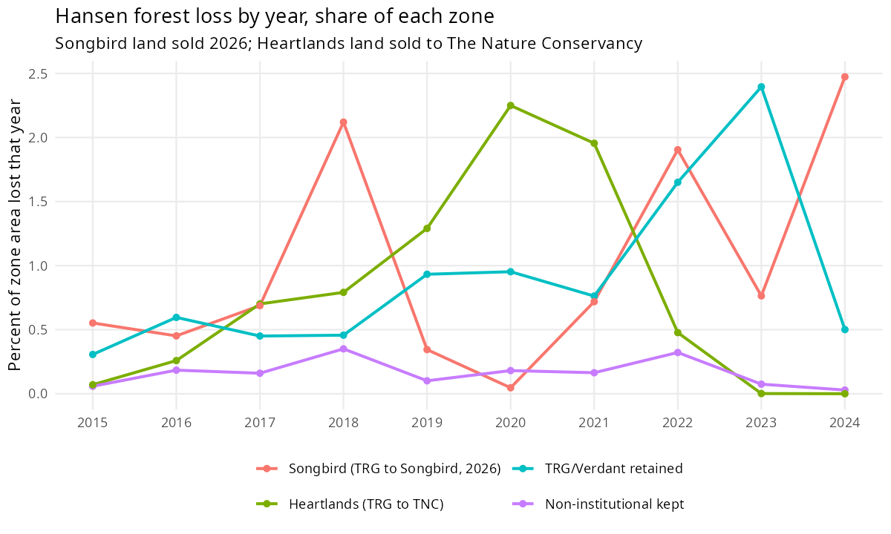

```{r}
#| label: setup
library(dplyr)
library(knitr)

fmt_n <- function(x) {
  format(round(as.numeric(x)), big.mark = ",", scientific = FALSE, trim = TRUE)
}
fmt_1 <- function(x) sprintf("%.1f", as.numeric(x))

root <- if (dir.exists("data/processed")) "." else ".."
rd <- function(f) read.csv(file.path(root, "data/processed", f), stringsAsFactors = FALSE)

rates <- rd("cfp_institutional_sellers_keepers_rates.csv")
buckets <- rd("cfp_institutional_exit_buckets.csv")
by_class <- rd("cfp_sellers_by_owner_class.csv")
zones <- rd("cfp_sale_footprint_zone_summary.csv")
years <- rd("cfp_sale_footprint_hansen_by_year.csv")

primary <- rates |> filter(sale_definition == "true_transfer", scope == "pooled")
b <- function(firm, bucket, col) {
  buckets[[col]][buckets$institutional_firm == firm & buckets$exit_bucket == bucket]
}
zn <- function(zone, col) zones[[col]][zones$zone == zone]
SB <- "Songbird (TRG to Songbird, 2026)"
KH <- "Heartlands (TRG to TNC)"
TV <- "TRG/Verdant retained"
```

### Question (from the drawing)

Among land held by **institutional owners** in 2020, did owners who **sold** by 2026 disturb their land more than owners who **kept** it? Major disturbance = mean parcel canopy cover (TCC) dropping more than 20 percentage points, 2020 → 2025.

### Short answer

**Pooled, no:** sellers and keepers look similar (`{r} fmt_1(primary$pct_parcels_major[primary$cohort == "seller"])`% vs `{r} fmt_1(primary$pct_parcels_major[primary$cohort == "keeper"])`% of parcels with major loss). **But the pooled number hides two opposite stories:**

- **Songbird land** (TRG → American Songbird, 2026): the **highest** disturbance of any group. `{r} fmt_n(b("TRG", "songbird", "n_major_disturbance"))` of `{r} fmt_n(b("TRG", "songbird", "n_parcels"))` parcels (`{r} fmt_1(b("TRG", "songbird", "pct_parcels_major"))`%) had major loss, and `{r} fmt_1(zn(SB, "pct_area_drop20_2020_2025"))`% of the footprint lost >20 pp canopy. Forest loss climbed through 2022–2024, i.e. **in the years before the sale**.
- **Heartlands land** (TRG → Verdant → The Nature Conservancy): **zero** parcels with major loss 2020–2025 and mean canopy **rose** `{r} fmt_1(zn(KH, "delta_pp_2020_2025"))` pp. Harvest peaked in 2020–2021 and dropped to ~0 by 2023–2024.
- **TRG/Verdant retained land** sits between them: `{r} fmt_1(b("TRG", "rebrand_same_family", "pct_parcels_major"))`% of parcels, `{r} fmt_1(zn(TV, "pct_area_drop20_2020_2025"))`% of area.

So "sold vs kept" matters less than **who the land was sold to and when**. All loss observed on both footprints happened while TRG/Verdant still owned the land (TCC ends in 2025; Hansen in 2024).

### Roster

| Firm label | 2020 CFP name match | Notes |
|:---|:---|:---|
| **TRG** | `TRG THRESHOLD…`, later `Verdant…` | Verdant treated as same-family rebrand, not a sale |
| **Lyme** | `LYME…` | Small (28 parcels) |
| **MWF** | `MWF…` | Molpus-family stand-in; no literal “Molpus” in HK CFP |
| **Manulife** | `MANULIFE…`, Hancock | **No parcels** in HK CFP 2020 |

### How “sold” is defined

- **Songbird / Heartlands:** parcels with ≥50% of their area inside the footprint polygons (Emma's Songbird layer, ~17,236 GIS acres; Keweenaw Heartlands, ~32,579 GIS acres). The 2026 CFP file still lists Songbird land as **Verdant** because the sale happened after that snapshot, so names alone would misclassify it as kept.
- **Other sale:** legal name changed to a different owner family, or parcel left CFP.
- **Kept:** same name, or TRG → Verdant rebrand.

### Parcel-level results by exit type

```{r}
#| label: tbl-buckets
lab <- c(
  songbird = "Sold to Songbird (2026)",
  tnc_heartlands = "Sold to TNC (Heartlands)",
  other_sale = "Other sale",
  left_cfp = "Left CFP",
  rebrand_same_family = "Kept (TRG → Verdant)",
  kept_same_name = "Kept (same name)"
)
buckets |>
  transmute(
    Firm = institutional_firm,
    Outcome = lab[exit_bucket],
    Parcels = fmt_n(n_parcels),
    Acres = fmt_n(acres),
    `Major-loss parcels` = fmt_n(n_major_disturbance),
    `% parcels` = fmt_1(pct_parcels_major),
    `% acres` = fmt_1(pct_acres_major),
    `Mean ΔTCC (pp)` = fmt_1(mean_delta_pp)
  ) |>
  kable()
```

### Pixel-level check (whole footprints, 30 m)

Parcel means can blur cuts on big parcels, so the same zones were summarised pixel by pixel. “Before” is 2015–2020, “after” is 2020–2025.

```{r}
#| label: tbl-zones
zones |>
  transmute(
    Zone = zone,
    Acres = fmt_n(acres),
    `ΔTCC before` = fmt_1(delta_pp_2015_2020),
    `ΔTCC after` = fmt_1(delta_pp_2020_2025),
    `% area >20 pp drop, after` = fmt_1(pct_area_drop20_2020_2025),
    `Hansen loss % 2015–19` = fmt_1(pct_hansen_loss_2015_2019),
    `Hansen loss % 2020–24` = fmt_1(pct_hansen_loss_2020_2024)
  ) |>
  kable()
```

Songbird land was **gaining** canopy before 2020 (+`{r} fmt_1(zn(SB, "delta_pp_2015_2020"))` pp) and then lost `{r} fmt_1(abs(zn(SB, "delta_pp_2020_2025")))` pp after, so the drop is not a continuation of an older trend.



### Secondary comparison: institutional vs non-institutional

The drawing sets non-institutional owners aside as apples-to-oranges, but suggests comparing sellers as collectives:

```{r}
#| label: tbl-class
by_class |>
  transmute(
    `Owner class` = owner_class,
    Cohort = cohort,
    Parcels = fmt_n(n_parcels),
    Acres = fmt_n(acres),
    `Major-loss parcels` = fmt_n(n_major_disturbance),
    `% parcels` = fmt_1(pct_parcels_major),
    `% acres` = fmt_1(pct_acres_major)
  ) |>
  kable()
```

```{r}
#| label: class-ratio
cr <- function(oc, c) by_class$pct_parcels_major[by_class$owner_class == oc & by_class$cohort == c]
ratio_kept <- cr("Institutional", "keeper") / cr("Non-institutional", "keeper")
ratio_sold <- cr("Institutional", "seller") / cr("Non-institutional", "seller")
```

Institutional land has about `r round(ratio_kept)`× the major-loss rate of non-institutional land among keepers and about `r round(ratio_sold)`× among sellers. Among non-institutional owners, sellers are slightly higher than keepers, but both are near 1%.

### By firm

- **TRG** drives almost everything (838 of 892 institutional parcels).
- **MWF** is small (~5,400 ac) but has the steepest canopy decline of any zone (`{r} fmt_1(zn("MWF", "delta_pp_2020_2025"))` pp, harvest 2022–2024), mostly on land it **kept**.
- **Lyme** shows little disturbance.
- **Manulife** has no CFP land here.

### Caveats

- **Timing:** TCC ends in 2025 and Hansen in 2024, so this measures what the seller did before selling, not what the buyer did after.
- **Sale dates:** the Heartlands sale date is not in these data. The Hansen drop to ~0 after 2022 is consistent with a change in management around then.
- **TCC vs Hansen on Heartlands:** Hansen shows 4.7% stand-replacing loss in 2020–2024, while modeled TCC rose. Regrowth on earlier cuts and TCC model noise can both do this. Use Hansen for timing and TCC for net canopy.
- **−20 pp threshold:** a screening cut, not a biodiversity standard (see the major-loss one-pager footnote).

### Methods

- **Scripts:** `scripts/09_cfp_parcel_tcc_change.R` (parcel TCC), `scripts/10_institutional_sellers_vs_keepers.R` (parcel classes and rates), `scripts/11_sale_footprint_pixels.R` (pixel zones and Hansen timing).
- **Footprints:** `data/American Songbird (17,315 acres)/`, `data/Keweenaw Heartlands/`.
- **Outputs:** `data/processed/cfp_institutional_*.csv`, `cfp_sellers_by_owner_class.csv`, `cfp_sale_footprint_*.csv`, `figures/cfp_sale_footprint_hansen_by_year.png`.
